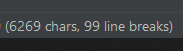

# FinalProject_CodeAcademy

event organization, staff and guest management system

## features
set up events, manage events, delete events,
assign staff to events, 
log guests and staff that attend or work each event,
guest and staff statuses,
account management,
admin and staff management,
email notifications,
Reporting,
Payment Processing,
Customizable Views,
Data Security,

prioritized from highest to lowest:

    1. Event creation, management, and deletion: The ability to create, manage, and delete events is the core feature of the system.

    2. Guest and staff logging: The ability to log guests and staff that attend or work each event is critical for keeping track of attendance and staffing needs.

    3. Staff assignment: The ability to assign staff to events is important for ensuring adequate staffing levels and managing schedules.

    4. Account management: User authentication and authorization functionality, and creating user roles for guests, staff, and administrators.

    5. Email notifications: Developing email notifications for events, updates, and reminders is important for keeping users informed about upcoming events and any changes to them.

    6. Reporting: Adding reporting functionality to generate reports on event attendance, staff allocation, and other relevant data is useful for analyzing event data and making informed decisions.

    7. Customizable views: Developing customizable views for different user roles is important for providing a personalized user experience and ensuring that users only see the information they need.

    8. Data security: Implementing security measures such as encryption, password hashing, and SSL to protect sensitive data is essential for maintaining the integrity of the system.

    9. Payment processing: Integrating a payment processing system such as Stripe or PayPal if you plan on charging for events can be added at a later stage, as it is not a core feature for the system to function.

## migrations
    1. Events migration: This migration would create a table to store information about events, including event name, date, location, and other relevant details.

    2. Staff migration: This migration would create a table to store information about staff members, including their name, contact details, and job title.

    3. Staff Event Assignment migration: This migration would create a table to store information about staff members assigned to events, including the staff member ID, event ID, and any other relevant details.

    4. Guests migration: This migration would create a table to store information about guests, including their name, contact details, and any other relevant details.

    5. Guests Event Attendance migration: This migration would create a table to store information about guests that attend events, including the guest ID, event ID, and any other relevant details.

    6. User migration: This migration would create a table to store information about system users, including their name, email, password, and other relevant details.

    7. Role migration: This migration would create a table to store information about user roles, including the role name and any associated permissions.

    8. Role User Assignment migration: This migration would create a table to store information about user roles assigned to system users, including the user ID, role ID, and any other relevant details.

    9. Email Notifications migration: This migration would create a table to store information about email notifications, including the recipient email, email subject, email body, and any other relevant details.

## project 
### not fully done yet! ###################################################################################################!

### Project Goals: 
    Clearly define the goals and objectives of your event staff and guest management system. 
    What is the main problem you are trying to solve and how will your system address it? 
    Who is your target audience and what benefits will your system provide for them?

### Features: 
    List the core features of your system, such as event setup, management, and deletion, staff assignment, guest and staff attendance tracking, account management, and email notifications. Prioritize these features based on their importance to the overall functionality of the system.

### Scope: 
    Define the scope of your project, including any limitations or constraints that may impact the development process. This may include factors such as budget, time constraints, or technical limitations.

### Technology Stack: 
    Specify the technology stack you plan to use for your system, including the programming language (PHP), web framework (Laravel), and any third-party libraries or services.

### Architecture: 
    Describe the overall architecture of your system, including the database schema, server configuration, and any other technical details.

### User Interface (UI) and User Experience (UX) Design:
    Explain how you plan to design the UI and UX for your system, including any design patterns or best practices you plan to follow.

### Development Process: 
    Outline the development process you plan to follow, including coding standards, testing procedures, and any other development guidelines.

### Deployment Plan: 
    Describe how you plan to deploy your system to a production environment, including the hosting provider and any necessary configuration.

### Support and Maintenance Plan: 
    Outline how you plan to provide ongoing support and maintenance for your system, including bug fixes, feature enhancements, and system updates.

### Timeline: 
    Create a timeline for the development of your system, including milestones and deadlines for each stage of the project.

### Budget: 
    Estimate the cost of developing and deploying your system, including the cost of any third-party services or resources.

### Risks and Mitigation Plan: 
    Identify potential risks and challenges that may arise during the development and deployment of your system, and describe how you plan to mitigate them.

### Communication Plan: 
    Outline how you plan to communicate with stakeholders, team members, and users throughout the development and deployment process.